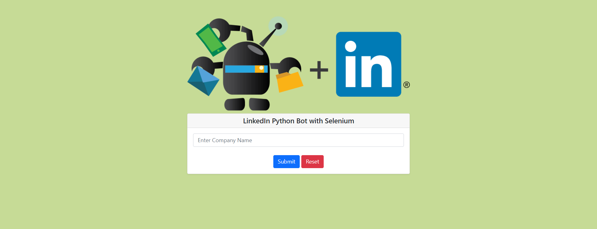

## **LinkedIn Bot With Python Selenium**
This application is built using Flask (Python) Framework and selenium to retrieve information from Linkedin website

#####This application logs into the linkedin website using selenium to retrieve a company's employee information
#####It creates an output file(.csv) of all employees and separately creates an experience.csv,projects.csv and education.csv which contains their experience,projects and education information respectively

##Setup and Usage
* Once you clone the repository ``git clone git@github.com:judeapana/linkedin_bot.git``
* Create environment depending on the package manager you want to use.
* Install requirements.txt file ``pip install -r requirements.txt``
* Rename the ``.example.env`` file to ``.env`` and complete the ___USERNAME__ and ___PASSWORD__ environment variables
* Run ``python manager.py``
* Navigate to ``127.0.0.1:5000``
* Enter the name of a company and hit submit
* Application will load a list of companies form which you can chose one by clicking on "request info" button
* Check your application directory, a new directory named after the company you searched with that file you will find sub-directories named after employees containing their information
* output.csv contains all company employee's bio information
* Each directory within the created main folder contains experience,project and projects of the employee
  
